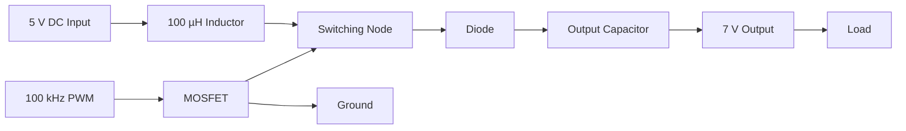
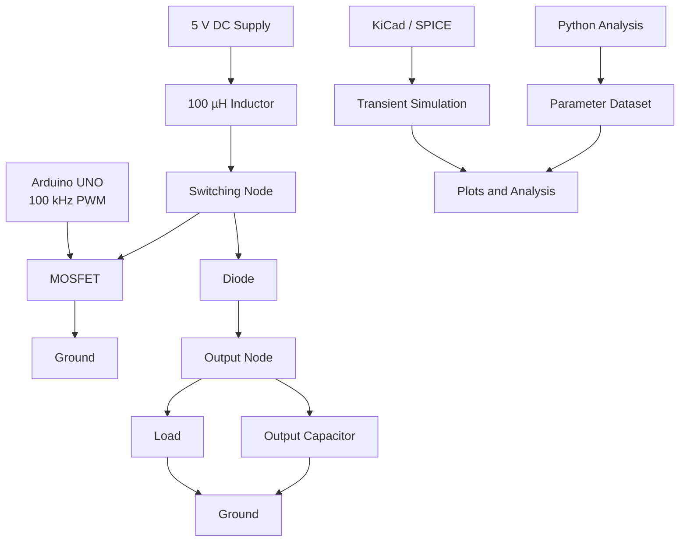

<div align="center">
⚡ 5 V → 7 V High-Frequency Boost Converter
Design • Simulation • Parametric Analysis • PWM Control • Hardware Development


A complete engineering study of a high-frequency DC-DC boost converter designed to step up a 5 V DC input toward a 7 V output.
</div>
---
📌 Project Overview
This project presents the design, mathematical analysis, simulation, parametric study, PWM generation, and hardware development of a 5 V to 7 V high-frequency boost converter.
The converter operates at approximately 100 kHz and uses PWM control to regulate the switching device.
The project combines:
Boost converter theory
Mathematical design
Component calculations
KiCad schematic design
SPICE transient simulation
Python-based numerical analysis
Parametric analysis
Dataset generation
Arduino UNO PWM generation
Wokwi PWM verification
Hardware component selection
Future PCB design
Future experimental validation
The main engineering objective is to study how duty cycle, switching frequency, inductance, capacitance, and load resistance influence converter performance.
---
🎯 Project Objectives
Design a 5 V to approximately 7 V boost converter.
Operate the converter at approximately 100 kHz.
Calculate the theoretical duty cycle.
Account for approximate diode forward-voltage effects.
Calculate output current and power.
Calculate inductor current ripple.
Estimate capacitor voltage ripple.
Develop the circuit in KiCad.
Perform transient SPICE simulation.
Generate PWM using Arduino UNO.
Verify PWM digitally using Wokwi.
Perform Python-based parameter sweeps.
Generate a theoretical engineering dataset.
Compare theoretical calculations with simulation results.
Develop a PCB in a later stage.
Validate the design experimentally in the future.
---
⚙️ Design Specifications
Simulation Configuration
The current KiCad/SPICE schematic uses:
Parameter	Value
Input voltage	5 V DC
Target output voltage	7 V DC
Switching frequency	100 kHz
Switching period	10 µs
PWM duty cycle	36%
ON time	3.6 µs
OFF time	6.4 µs
Inductor	100 µH
Output capacitor	1000 µF
Simulation load	24 Ω
PWM amplitude	0–5 V
Switching device	NMOS SPICE model
Diode	SPICE diode model
---
Hardware Prototype Configuration
The planned physical prototype uses:
Parameter	Value
Input voltage	5 V DC
Target output voltage	7 V DC
Switching frequency	100 kHz
Initial duty cycle	approximately 35–36%
Inductor	100 µH
Output capacitor	220 µF / 35 V
Hardware load	27 Ω / 10 W
MOSFET	IRLZ44N
Diode	1N5822
PWM controller	Arduino UNO
Input supply	5 V / 2 A regulated adapter
> **Note:** The simulation and hardware configurations are intentionally different. The current simulation uses a 1000 µF capacitor and 24 Ω load, while the planned hardware prototype uses a 220 µF / 35 V capacitor and 27 Ω / 10 W load.
---
🔄 Boost Converter Operating Principle
A boost converter increases DC voltage by storing energy in an inductor during the MOSFET ON interval and transferring that energy to the output during the MOSFET OFF interval.

---
🔌 Circuit Topology
```text
                         L1
                       100 µH
5 V ────────────────coil────────●────────|>|────────── +VOUT
                                │          D1
                                │
                                D
                              Q1
                             NMOS
                                S
                                │
                               GND


                              +VOUT
                                │
                    ┌───────────┴───────────┐
                    │                       │
                   C1                      RLOAD
                    │                       │
                   GND                     GND


Arduino PWM ─────── Gate
```
---
📐 Complete Design Calculations
1. Ideal Boost Converter Equation
For an ideal boost converter operating in continuous conduction mode:
$$
V_o = \frac{V_{in}}{1-D}
$$
where:
$V_o$ = output voltage
$V_{in}$ = input voltage
$D$ = duty cycle
Rearranging:
$$
D = 1-\frac{V_{in}}{V_o}
$$
---
2. Ideal Duty Cycle for 5 V → 7 V
Given:
$$
V_{in}=5\text{ V}
$$
$$
V_o=7\text{ V}
$$
Therefore:
$$
D=1-\frac{5}{7}
$$
$$
D=0.2857
$$
Therefore:
$$
\boxed{D_{ideal}=28.57%}
$$
---
3. Practical Duty Cycle
A real converter has losses caused by:
Diode forward voltage
MOSFET resistance
Inductor resistance
Switching losses
Capacitor ESR
PCB parasitics
Using an approximate diode forward voltage of:
$$
V_D\approx0.7\text{ V}
$$
A simplified practical relationship is:
$$
V_o\approx\frac{V_{in}}{1-D}-V_D
$$
Rearranging:
$$
D\approx1-\frac{V_{in}}{V_o+V_D}
$$
Substituting:
$$
D\approx1-\frac{5}{7+0.7}
$$
$$
D\approx0.3506
$$
Therefore:
$$
\boxed{D_{practical}\approx35.06%}
$$
The current KiCad simulation uses:
$$
\boxed{D_{simulation}=36%}
$$
---
⏱️ Switching Timing Calculations
4. Switching Period
Given:
$$
f_s=100\text{ kHz}
$$
The switching period is:
$$
T=\frac{1}{f_s}
$$
$$
T=\frac{1}{100000}
$$
Therefore:
$$
\boxed{T=10\ \mu s}
$$
---
5. ON Time
For a duty cycle of 36%:
$$
T_{ON}=DT
$$
$$
T_{ON}=0.36(10\ \mu s)
$$
Therefore:
$$
\boxed{T_{ON}=3.6\ \mu s}
$$
---
6. OFF Time
$$
T_{OFF}=T-T_{ON}
$$
$$
T_{OFF}=10-3.6
$$
Therefore:
$$
\boxed{T_{OFF}=6.4\ \mu s}
$$
---
🔋 Output Current and Power
7. Simulation Load Current
The KiCad simulation uses:
$$
R_{load}=24\Omega
$$
For:
$$
V_o=7\text{ V}
$$
Output current is:
$$
I_o=\frac{V_o}{R_{load}}
$$
$$
I_o=\frac{7}{24}
$$
Therefore:
$$
\boxed{I_o\approx0.292\text{ A}}
$$
---
8. Simulation Output Power
$$
P_o=V_oI_o
$$
$$
P_o=7(0.292)
$$
Therefore:
$$
\boxed{P_o\approx2.04\text{ W}}
$$
Alternatively:
$$
P_o=\frac{V_o^2}{R_{load}}
$$
$$
P_o=\frac{7^2}{24}
$$
$$
\boxed{P_o\approx2.04\text{ W}}
$$
---
🔌 Input Current Estimate
Ignoring converter losses:
$$
P_{in}\approx P_o
$$
Therefore:
$$
I_{in}\approx\frac{P_o}{V_{in}}
$$
$$
I_{in}\approx\frac{2.04}{5}
$$
Therefore:
$$
\boxed{I_{in}\approx0.408\text{ A}}
$$
The actual input current will be higher when converter losses are included.
---
🌀 Inductor Calculations
9. Inductor Current Ripple
For the simplified boost converter:
$$
\Delta I_L=
\frac{V_{in}D}{Lf_s}
$$
Using:
$$
V_{in}=5\text{ V}
$$
$$
D=0.36
$$
$$
L=100\ \mu H
$$
$$
f_s=100\text{ kHz}
$$
Therefore:
$$
\Delta I_L=
\frac{5(0.36)}
{(100\times10^{-6})(100000)}
$$
Therefore:
$$
\boxed{\Delta I_L\approx0.18\text{ A}}
$$
---
10. Peak Inductor Current
Using the ideal average input-current estimate:
$$
I_{L,avg}\approx0.408\text{ A}
$$
The peak current is:
$$
I_{L,peak}
I_{L,avg}
+
\frac{\Delta I_L}{2}
$$
$$
I_{L,peak}
0.408+\frac{0.18}{2}
$$
Therefore:
$$
\boxed{I_{L,peak}\approx0.498\text{ A}}
$$
---
11. Minimum Inductor Current
$$
I_{L,min}
I_{L,avg}
\frac{\Delta I_L}{2}
$$
$$
I_{L,min}
0.408-\frac{0.18}{2}
$$
Therefore:
$$
\boxed{I_{L,min}\approx0.318\text{ A}}
$$
Since the simplified result is greater than zero, the operating point is consistent with continuous-conduction behavior.
---
🧪 Output Capacitor Calculation
12. Approximate Capacitor Ripple
The approximate output-voltage ripple is:
$$
\Delta V_o
\approx
\frac{I_oD}{f_sC}
$$
For the current simulation:
$$
I_o=0.292\text{ A}
$$
$$
D=0.36
$$
$$
f_s=100\text{ kHz}
$$
$$
C=1000\ \mu F
$$
Therefore:
$$
\Delta V_o
\approx
\frac{0.292(0.36)}
{(100000)(1000\times10^{-6})}
$$
Therefore:
$$
\boxed{\Delta V_o\approx1.05\text{ mV}}
$$
This is an idealized capacitor-ripple estimate. Actual SPICE or hardware ripple can differ because of ESR, ESL, switching behavior, diode characteristics, MOSFET characteristics, and parasitic elements.
---
🔋 Hardware Load Calculation
The planned hardware prototype uses:
$$
R_{load}=27\Omega
$$
13. Hardware Load Current at 7 V
$$
I_o=\frac{V_o}{R}
$$
$$
I_o=\frac{7}{27}
$$
Therefore:
$$
\boxed{I_o\approx0.259\text{ A}}
$$
---
14. Hardware Load Power at 7 V
$$
P_o=\frac{V_o^2}{R}
$$
$$
P_o=\frac{7^2}{27}
$$
$$
P_o=\frac{49}{27}
$$
Therefore:
$$
\boxed{P_o\approx1.81\text{ W}}
$$
The selected resistor is rated at:
$$
\boxed{10\text{ W}}
$$
---
🔥 Hardware Load at 12 V
The same 27 Ω resistor can also be considered for a future 12 V operating test.
$$
P=\frac{V^2}{R}
$$
$$
P=\frac{12^2}{27}
$$
$$
P=\frac{144}{27}
$$
Therefore:
$$
\boxed{P\approx5.33\text{ W}}
$$
The resistor is rated for 10 W, but it can become hot during operation.
---
📈 Voltage Gain
The required voltage gain is:
$$
M=\frac{V_o}{V_{in}}
$$
$$
M=\frac{7}{5}
$$
Therefore:
$$
\boxed{M=1.4}
$$
---
📐 Critical Inductance
An approximate critical inductance for the CCM/DCM boundary is:
$$
L_{crit}
\approx
\frac{D(1-D)^2R}{2f_s}
$$
Using:
$$
D=0.36
$$
$$
R=24\Omega
$$
$$
f_s=100\text{ kHz}
$$
Therefore:
$$
L_{crit}
\approx
\frac{0.36(1-0.36)^2(24)}
{2(100000)}
$$
Therefore:
$$
\boxed{L_{crit}\approx17.7\ \mu H}
$$
The selected simulation inductance is:
$$
L=100\ \mu H
$$
Therefore:
$$
100\ \mu H > 17.7\ \mu H
$$
This supports continuous-conduction operation under the simplified design assumptions.
---
📊 Efficiency
Converter efficiency is:
$$
\eta=
\frac{P_{out}}{P_{in}}\times100
$$
where:
$$
P_{out}=V_oI_o
$$
and:
$$
P_{in}=V_{in}I_{in}
$$
Therefore:
$$
\boxed{
\eta=
\frac{V_oI_o}
{V_{in}I_{in}}
\times100
}
$$
Experimental efficiency will only be reported after actual hardware measurements are obtained.
---
📉 Percentage Error
Theoretical and simulated values can be compared using:
$$
Error(%)=
\frac{|V_{theory}-V_{simulation}|}
{V_{theory}}
\times100
$$
For example:
```python
error = abs(V_theory - V_simulation) / V_theory * 100
```
---
📊 Calculation Summary
Quantity	Value
Input voltage	5 V
Target output voltage	7 V
Ideal duty cycle	28.57%
Practical calculated duty	≈35.06%
Simulation duty	36%
Switching frequency	100 kHz
Switching period	10 µs
ON time	3.6 µs
OFF time	6.4 µs
Simulation inductance	100 µH
Inductor ripple	≈0.18 A
Average input current estimate	≈0.408 A
Peak inductor current estimate	≈0.498 A
Minimum inductor current estimate	≈0.318 A
Simulation load	24 Ω
Simulation output current	≈0.292 A
Simulation output power	≈2.04 W
Simulation capacitor	1000 µF
Approximate capacitor ripple	≈1.05 mV
Approximate critical inductance	≈17.7 µH
Ideal voltage gain	1.4
---
🧠 Simulation vs Hardware
The two configurations are documented separately.
Simulation
```text
Input voltage       = 5 V
Target output       = 7 V
Switching frequency = 100 kHz
Duty cycle          = 36%
Inductor            = 100 µH
Capacitor           = 1000 µF
Load                = 24 Ω
```
Hardware
```text
Input voltage       = 5 V
Target output       = 7 V
Switching frequency = 100 kHz
Duty cycle          = approximately 35–36%
Inductor            = 100 µH
Capacitor           = 220 µF / 35 V
Load                = 27 Ω / 10 W
MOSFET              = IRLZ44N
Diode               = 1N5822
Controller          = Arduino UNO
```
---
🔬 KiCad / SPICE Simulation
The KiCad project contains the boost-converter schematic and project configuration.
Project structure:
```text
kicad/
└── Exp_1/
    ├── Exp_1.kicad_pro
    └── Exp_1.kicad_sch
```
The schematic contains:
5 V DC source
100 µH inductor
NMOS switching device
Diode
Output capacitor
Resistive load
PWM source
Ground references
The PCB layout is planned for a later stage.
---
📐 Circuit Schematic
The repository contains the exported KiCad schematic image in the project results directory.
The schematic represents:
```text
5 V Input
   │
   ▼
100 µH Inductor
   │
   ├───────────────┐
   │               │
   ▼               ▼
 MOSFET           Diode
   │               │
  GND              ├──────► Output
                   │
              Capacitor
                   │
                  GND

Output
   │
   ▼
Load
```
---
💻 Python Analysis
Python is used for:
Mathematical calculations
PWM waveform generation
Parameter sweeps
Dataset generation
Numerical analysis
Plot generation
Theory versus simulation comparison
Main libraries:
```python
import numpy as np
import pandas as pd
import scipy
import matplotlib.pyplot as plt
```
Install the required packages:
```bash
pip install -r requirements.txt
```
---
📡 PWM Generation
The target PWM signal is:
Parameter	Target
HIGH level	5 V
LOW level	0 V
Frequency	100 kHz
Period	10 µs
Duty cycle	approximately 35–36%
ON time	approximately 3.5–3.6 µs
OFF time	approximately 6.4–6.5 µs
Conceptual waveform:
```text
5 V     ┌────────┐                 ┌────────┐
        │        │                 │        │
0 V ────┘        └─────────────────┘        └────

        ← 3.6 µs →
        ←──────────── 10 µs ────────────────→
```
---
🤖 Arduino UNO PWM
The Arduino UNO is intended to generate the high-frequency PWM signal used to control the MOSFET.
Target:
$$
f_s=100\text{ kHz}
$$
and:
$$
D\approx35-36%
$$
The Arduino implementation is planned under:
```text
Arduino/
└── 100kHz_PWM/
    └── pwm_100khz.ino
```
> Standard `analogWrite()` operation is generally not suitable for a 100 kHz target, so timer configuration is required.
---
🧪 Wokwi PWM Verification
Wokwi is used to verify the digital PWM signal before connecting the Arduino to the physical power stage.
Verification targets:
Parameter	Target
Frequency	≈100 kHz
Duty cycle	≈35–36%
HIGH level	5 V
LOW level	0 V
Period	≈10 µs
Pulse width	≈3.5–3.6 µs
Project files are maintained in the Wokwi project directory.
---
📊 Simulation Waveforms
The SPICE simulation is used to analyze:
Output Voltage
$$
V_{out}(t)
$$
Used to study:
Startup
Overshoot
Settling
Steady-state voltage
Output ripple
Gate Voltage
$$
V_G(t)
$$
Used to verify:
Switching frequency
Duty cycle
Pulse width
Inductor Current
$$
I_L(t)
$$
Used to determine:
Average current
Ripple current
Peak current
Conduction mode
Diode Current
$$
I_D(t)
$$
Used to study the energy-transfer interval.
MOSFET Current
$$
I_{DS}(t)
$$
Used to examine switching behavior and current stress.
---
📈 Parametric Analysis
The project investigates the effect of several converter parameters.
Duty Cycle Sweep
Example values:
```text
20%
25%
30%
35%
36%
40%
45%
50%
55%
60%
```
The ideal boost relationship is:
$$
V_o=\frac{V_{in}}{1-D}
$$
The actual simulated output can differ because of non-ideal component behavior.
---
Switching Frequency Sweep
Example values:
```text
50 kHz
75 kHz
100 kHz
150 kHz
200 kHz
```
Parameters investigated:
Inductor ripple
Output ripple
Switching behavior
Estimated losses
---
Inductance Sweep
Example values:
```text
47 µH
68 µH
100 µH
150 µH
220 µH
330 µH
```
Parameters investigated:
Inductor current ripple
Peak current
Conduction mode
Transient behavior
---
Capacitance Sweep
Example values:
```text
47 µF
100 µF
220 µF
470 µF
1000 µF
```
Parameters investigated:
Output voltage ripple
Startup behavior
Transient response
---
Load Sweep
Example values:
```text
10 Ω
15 Ω
22 Ω
24 Ω
27 Ω
33 Ω
47 Ω
68 Ω
```
Parameters investigated:
Output voltage
Output current
Output power
Converter behavior under different loads
---
🗃️ Dataset Generation
A theoretical dataset is generated using Python by sweeping converter parameters.
Input Parameters
```text
Input Voltage
Duty Cycle
Switching Frequency
Inductance
Capacitance
Load Resistance
```
Output Parameters
```text
Ideal Output Voltage
Approximate Practical Output Voltage
Output Current
Output Power
Input Current
Inductor Ripple Current
Peak Inductor Current
Output Voltage Ripple
Critical Inductance
Conduction Mode
```
Analytical datasets are clearly distinguished from SPICE simulation results and experimental measurements.
---
📊 Planned Graphs
The following graphs are planned for the completed analysis:
Output Voltage vs Duty Cycle
Shows the relationship between PWM duty cycle and converter output voltage.
Output Ripple vs Capacitance
Shows how increasing output capacitance affects the estimated output-voltage ripple.
Inductor Ripple vs Inductance
Shows the inverse relationship between inductance and inductor-current ripple.
Theoretical vs Simulation
Compares calculated values against values obtained from SPICE simulation.
> **Note:** Graphs are not embedded here until the actual result files are generated. This prevents broken 404 image links in the repository.
---
🎬 Project Visualization
The project can later include an animation showing the operating sequence:
```text
5 V Input
    ↓
Inductor Energy Storage
    ↓
MOSFET Switching
    ↓
Diode Energy Transfer
    ↓
Capacitor Charging
    ↓
7 V Output
```
An animation will only be referenced after the actual animation file has been added to the repository.
---
🧩 Complete System Architecture

---
🔬 Development Workflow

---
⚡ Practical Component Considerations
A real converter differs from an ideal mathematical model.
MOSFET
Important parameters include:
$$
R_{DS(on)}
$$
and switching losses.
---
Diode
The diode introduces forward-voltage loss:
$$
V_D
$$
Reverse-recovery and junction-capacitance effects can also influence switching behavior.
---
Inductor
A real inductor has:
DC resistance
Core loss
Saturation current
Parasitic capacitance
---
Capacitor
A real capacitor has:
ESR
ESL
Leakage
Ripple-current limitations
---
PCB
The final PCB should minimize:
Switching-loop area
Parasitic inductance
Unnecessary trace length
Ground impedance
---
🔥 Thermal Considerations
The hardware prototype contains switching components and a power resistor.
For the 27 Ω resistor at 7 V:
$$
P=\frac{V^2}{R}
$$
$$
P=\frac{7^2}{27}
$$
Therefore:
$$
\boxed{P\approx1.81\text{ W}}
$$
At 12 V:
$$
P=\frac{12^2}{27}
$$
Therefore:
$$
\boxed{P\approx5.33\text{ W}}
$$
The resistor can therefore become hot during operation and must be positioned appropriately.
The MOSFET and diode will also dissipate power because of conduction and switching losses.
---
🔬 Experimental Validation
The planned hardware setup is:
```text
5 V DC Supply
      │
      ▼
Boost Converter
      │
      ▼
7 V Output
      │
      ▼
27 Ω / 10 W Load
```
Measurements planned:
Input voltage
Input current
Output voltage
Output current
Output ripple
PWM frequency
PWM duty cycle
Inductor current
MOSFET temperature
Diode temperature
Load temperature
Input power
Output power
Efficiency
---
📐 Experimental Efficiency
Once actual measurements are available:
$$
P_{in}=V_{in}I_{in}
$$
$$
P_{out}=V_oI_o
$$
Therefore:
$$
\boxed{
\eta=
\frac{P_{out}}{P_{in}}\times100
}
$$
No experimental efficiency value is claimed until actual measurements are obtained.
---
📊 Theory vs SPICE vs Hardware
The final project will compare:
Parameter	Theory	SPICE	Hardware
Output voltage	—	—	—
Output current	—	—	—
Output ripple	—	—	—
Input current	—	—	—
Output power	—	—	—
Input power	—	—	—
Efficiency	—	—	—
Peak inductor current	—	—	—
Switching frequency	—	—	—
Values will be added only when the corresponding calculations, simulations, or measurements are completed.
---
⚠️ Safety
This project is intended for low-voltage DC operation.
The boost converter must not be connected directly to household AC mains.
The intended input source is:
$$
\boxed{5\text{ V DC}}
$$
The converter switching frequency is:
$$
\boxed{100\text{ kHz}}
$$
This is independent of the 50 Hz frequency of household AC power.
The 27 Ω / 10 W resistor can become hot during operation.
Hardware testing should be performed using suitable current limiting and appropriate electrical precautions.
---
🧠 Engineering Questions Investigated
1. Duty Cycle
How does changing duty cycle affect output voltage?
2. Switching Frequency
How does switching frequency affect current and voltage ripple?
3. Inductance
How does inductance affect inductor-current ripple?
4. Capacitance
How does output capacitance affect voltage ripple and startup behavior?
5. Load
How does load resistance affect output voltage and current?
6. Non-Ideal Components
How do MOSFET and diode losses change ideal boost-converter behavior?
7. Theory vs Simulation
How closely does the analytical model agree with the SPICE switching model?
8. Simulation vs Hardware
How closely does the physical prototype behave compared with simulation?
---
📁 Repository Structure
```text
5V-to-7V-Boost-Converter/
│
├── kicad/
│   └── Exp_1/
│       ├── Exp_1.kicad_pro
│       └── Exp_1.kicad_sch
│
├── notebooks/
│   ├── boost_converter_analysis.ipynb
│   └── ...
│
├── results/
│   ├── schematic/
│   ├── plots/
│   ├── simulation/
│   └── animations/
│
├── data/
│   └── boost_converter_theoretical_dataset.csv
│
├── Arduino/
│   └── 100kHz_PWM/
│       └── pwm_100khz.ino
│
├── Wokwi/
│   ├── diagram.json
│   └── pwm_test.ino
│
├── documentation/
│
├── README.md
├── requirements.txt
└── .gitignore
```
---
🧰 Tools Used
Tool	Purpose
KiCad 10	Schematic and future PCB design
SPICE	Transient circuit simulation
Python	Mathematical and numerical analysis
NumPy	Numerical computation
SciPy	Scientific computation
Pandas	Dataset processing
Matplotlib	Graph generation
Arduino UNO	PWM generation
Wokwi	Digital PWM verification
Jupyter Notebook	Interactive analysis
GitHub	Version control and documentation
---
📚 Reproducibility
KiCad
Open the KiCad project:
```text
kicad/Exp_1/Exp_1.kicad_pro
```
Then open the schematic in KiCad.
Python
Install the required dependencies:
```bash
pip install -r requirements.txt
```
Launch Jupyter:
```bash
jupyter notebook
```
Then open the notebooks directory.
---
📌 Key Equations
For quick reference:
Boost Converter
$$
\boxed{
V_o=\frac{V_{in}}{1-D}
}
$$
Ideal Duty Cycle
$$
\boxed{
D=1-\frac{V_{in}}{V_o}
}
$$
Practical Duty Cycle
$$
\boxed{
D\approx1-\frac{V_{in}}{V_o+V_D}
}
$$
Switching Period
$$
\boxed{
T=\frac{1}{f_s}
}
$$
ON Time
$$
\boxed{
T_{ON}=DT
}
$$
OFF Time
$$
\boxed{
T_{OFF}=(1-D)T
}
$$
Inductor Ripple
$$
\boxed{
\Delta I_L=
\frac{V_{in}D}{Lf_s}
}
$$
Output Current
$$
\boxed{
I_o=\frac{V_o}{R}
}
$$
Output Power
$$
\boxed{
P_o=V_oI_o
}
$$
Capacitor Ripple
$$
\boxed{
\Delta V_o\approx
\frac{I_oD}{f_sC}
}
$$
Efficiency
$$
\boxed{
\eta=
\frac{P_o}{P_{in}}\times100
}
$$
Percentage Error
$$
\boxed{
Error(%)=
\frac{|V_{theory}-V_{simulation}|}
{V_{theory}}\times100
}
$$
---
📊 Project Status
Development Area	Status
Boost Converter Theory	🟢 Completed
Mathematical Calculations	🟢 Completed
Python Analysis	🟢 Completed
KiCad Schematic	🟢 Completed
Initial SPICE Simulation	🟢 Completed
PWM Analysis	🟢 Completed
Wokwi Verification	🟢 Completed
Parameter Dataset	🟡 In Progress
Result Visualization	🟡 In Progress
Arduino Hardware PWM	🟡 In Progress
PCB Design	🔴 Planned
Physical Prototype	🟡 In Progress
Experimental Measurements	🔴 Pending
Efficiency Measurement	🔴 Pending
Theory vs Hardware	🔴 Pending
Closed-Loop Regulation	🔴 Planned
Status Legend
🟢 Completed  
🟡 In Progress  
🔴 Planned / Pending
---
🚀 Future Work

Planned development:
[x] Boost-converter theoretical analysis
[x] Mathematical calculations
[x] Python analytical model
[x] Initial component selection
[x] KiCad schematic
[x] Initial SPICE simulation
[x] PWM analysis
[x] Wokwi PWM verification
[x] GitHub repository
[ ] Complete parameter-sweep result plots
[ ] Complete Arduino PWM implementation
[ ] PCB layout
[ ] Gerber generation
[ ] Hardware prototype
[ ] Experimental measurements
[ ] Efficiency measurement
[ ] Thermal analysis
[ ] Theory vs SPICE comparison
[ ] SPICE vs hardware comparison
[ ] Closed-loop voltage regulation
[ ] Soft-start implementation
[ ] Switching transient optimization
---
⚠️ Current Limitations
The current project has several limitations:
The primary results are analytical and simulation based.
Real component tolerances are not completely represented.
MOSFET switching losses may differ from the SPICE model.
Diode forward voltage varies with current and temperature.
Inductor DCR and saturation are not fully represented in the simplified model.
Capacitor ESR and ESL can change actual ripple.
PCB parasitics are not yet included in the final layout.
Experimental efficiency has not yet been measured.
Experimental oscilloscope waveforms have not yet been obtained.
Hardware results will be added only after actual measurements.
---
📜 Project Integrity
Results in this repository are classified as:
Result Type	Meaning
Theoretical	Calculated from converter equations
Analytical	Generated using Python mathematical models
Simulation	Obtained from KiCad/SPICE
Experimental	Obtained from physical hardware
Simulation and analytical results are not presented as experimental measurements.
---
👨‍💻 Author
<div align="center">
RAVINUTALA NAGA VENKATA SAI NANDAN
Electronics and Communication Engineering

</div>
---
⭐ Project
If you find this project useful for learning about:
Power Electronics • Boost Converters • SPICE • KiCad • PWM • Python • Embedded Systems
consider giving the repository a ⭐.
---
<div align="center">
⚡ 5 V → 7 V
Design → Calculate → Simulate → Analyze → Optimize → Build → Validate
</div>