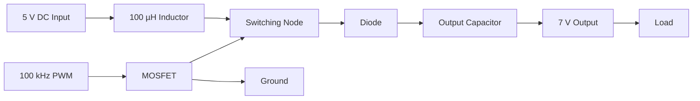
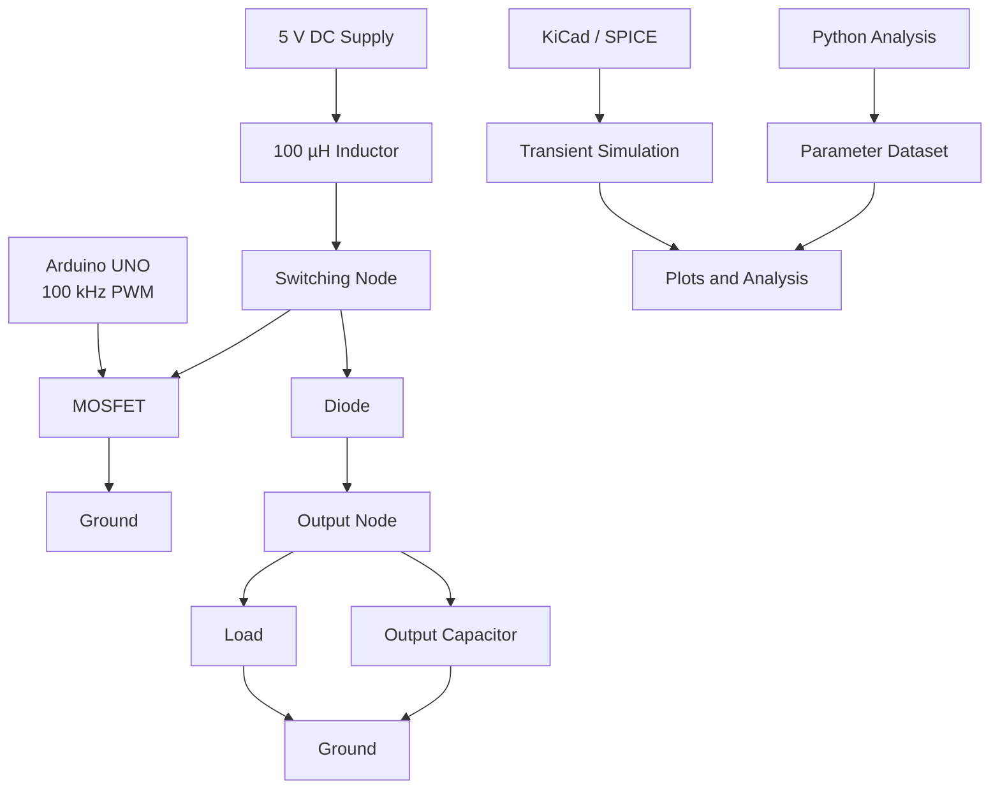

<div align="center">

# ⚡ 5 V → 7 V High-Frequency Boost Converter

### Design • Simulation • Parametric Analysis • PWM Control • Hardware Development

<br>


<br>


<br>

**A complete engineering study of a high-frequency DC-DC boost converter designed to step up a 5 V DC input toward a 7 V output.**

<br>

[📐 Schematic](#-circuit-schematic) •
[🧮 Calculations](#-complete-design-calculations) •
[💻 Python](#-python-analysis) •
[🔬 Simulation](#-kicad--spice-simulation) •
[📊 Results](#-results) •
[🚀 Future Work](#-future-work)

</div>

---

# 📌 Project Overview

This project focuses on the design, simulation, analysis, and hardware development of a **5 V to 7 V high-frequency boost converter** operating at approximately **100 kHz**.

The project combines:

- Boost converter theory
- Mathematical design
- Component calculations
- KiCad schematic design
- SPICE transient simulation
- Python-based numerical analysis
- Parametric analysis
- Dataset generation
- Arduino UNO PWM generation
- Wokwi PWM verification
- Hardware component selection
- Future PCB design
- Future experimental validation

The main objective is to investigate how **duty cycle, switching frequency, inductance, capacitance, and load resistance** influence the behavior of a boost converter.

---

# 🎯 Project Objectives

- Design a 5 V to approximately 7 V boost converter.
- Operate the converter at approximately 100 kHz.
- Calculate the theoretical PWM duty cycle.
- Analyze practical duty-cycle requirements.
- Calculate load current and output power.
- Calculate inductor current ripple.
- Estimate capacitor voltage ripple.
- Develop the circuit in KiCad.
- Perform transient SPICE simulation.
- Generate PWM using an Arduino UNO.
- Verify PWM digitally using Wokwi.
- Perform Python-based parameter sweeps.
- Generate a theoretical engineering dataset.
- Compare theoretical calculations with simulation results.
- Develop a PCB in a later stage.
- Validate the design experimentally in the future.

---

# ⚙️ Design Specifications

## Simulation Configuration

The current KiCad/SPICE schematic uses:

| Parameter | Value |
|---|---:|
| Input voltage | **5 V DC** |
| Target output | **7 V DC** |
| Switching frequency | **100 kHz** |
| Switching period | **10 µs** |
| PWM duty cycle | **36%** |
| ON time | **3.6 µs** |
| OFF time | **6.4 µs** |
| Inductor | **100 µH** |
| Output capacitor | **1000 µF** |
| Simulation load | **24 Ω** |
| PWM amplitude | **0–5 V** |
| Switching device | **NMOS SPICE model** |
| Diode | **SPICE diode model** |

---

## Hardware Prototype Configuration

The planned physical prototype uses:

| Parameter | Value |
|---|---:|
| Input voltage | **5 V DC** |
| Target output | **7 V DC** |
| Switching frequency | **100 kHz** |
| Initial duty cycle | **≈35–36%** |
| Inductor | **100 µH** |
| Output capacitor | **220 µF / 35 V** |
| Hardware load | **27 Ω / 10 W** |
| MOSFET | **IRLZ44N** |
| Diode | **1N5822** |
| PWM controller | **Arduino UNO** |
| Input supply | **5 V / 2 A regulated adapter** |

> **Important:** The simulation and hardware configurations are intentionally documented separately. The current KiCad simulation uses **1000 µF and 24 Ω**, while the planned hardware prototype uses **220 µF / 35 V and 27 Ω / 10 W**.

---

# 🔄 Boost Converter Operating Principle

A boost converter increases DC voltage by storing energy in an inductor during the MOSFET ON interval and transferring that energy to the output during the MOSFET OFF interval.



---

# 🔌 Circuit Topology

```text
                         L1
                       100 µH
5 V ────────────────coil────────●────────|>|────────── +VOUT
                                │          D1
                                │
                                D
                              Q1
                             NMOS
                                S
                                │
                               GND


                              +VOUT
                                │
                    ┌───────────┴───────────┐
                    │                       │
                   C1                      RLOAD
                    │                       │
                   GND                     GND


Arduino PWM ─────── Gate
```

---

# 📐 Complete Design Calculations

<details>
<summary><strong>Click here to expand the complete engineering calculations</strong></summary>

## 1. Ideal Boost Converter Equation

For an ideal boost converter operating in continuous conduction mode:

\[
V_o = \frac{V_{in}}{1-D}
\]

where:

- \(V_o\) = output voltage
- \(V_{in}\) = input voltage
- \(D\) = duty cycle

Rearranging:

\[
D = 1-\frac{V_{in}}{V_o}
\]

---

## 2. Ideal Duty Cycle for 5 V → 7 V

Given:

\[
V_{in}=5V
\]

\[
V_o=7V
\]

Therefore:

\[
D=1-\frac{5}{7}
\]

\[
D=0.2857
\]

Therefore:

\[
\boxed{D_{ideal}=28.57\%}
\]

---

## 3. Practical Duty Cycle

Real converters have losses caused by:

- Diode forward voltage
- MOSFET resistance
- Inductor resistance
- Switching losses
- Capacitor ESR
- PCB parasitics

Using an approximate diode forward voltage:

\[
V_D\approx0.7V
\]

A simplified practical relationship is:

\[
V_o\approx\frac{V_{in}}{1-D}-V_D
\]

Therefore:

\[
D\approx1-\frac{V_{in}}{V_o+V_D}
\]

Substituting:

\[
D\approx1-\frac{5}{7+0.7}
\]

\[
D\approx0.3506
\]

Therefore:

\[
\boxed{D_{practical}\approx35.06\%}
\]

The KiCad simulation uses:

\[
\boxed{D_{simulation}=36\%}
\]

---

## 4. Switching Period

Given:

\[
f_s=100kHz
\]

The switching period is:

\[
T=\frac{1}{f_s}
\]

\[
T=\frac{1}{100000}
\]

\[
\boxed{T=10\mu s}
\]

---

## 5. ON Time

For:

\[
D=36\%
\]

\[
T_{ON}=DT
\]

\[
T_{ON}=0.36(10\mu s)
\]

\[
\boxed{T_{ON}=3.6\mu s}
\]

---

## 6. OFF Time

\[
T_{OFF}=T-T_{ON}
\]

\[
T_{OFF}=10-3.6
\]

\[
\boxed{T_{OFF}=6.4\mu s}
\]

---

## 7. Output Current — Simulation Load

The KiCad simulation uses:

\[
R_{load}=24\Omega
\]

At:

\[
V_o=7V
\]

\[
I_o=\frac{V_o}{R}
\]

\[
I_o=\frac{7}{24}
\]

\[
\boxed{I_o\approx0.292A}
\]

---

## 8. Simulation Output Power

\[
P_o=V_oI_o
\]

\[
P_o=7(0.2917)
\]

\[
\boxed{P_o\approx2.04W}
\]

Alternatively:

\[
P_o=\frac{V_o^2}{R}
\]

\[
P_o=\frac{7^2}{24}
\]

\[
\boxed{P_o\approx2.04W}
\]

---

## 9. Ideal Input Current

Ignoring converter losses:

\[
P_{in}\approx P_o
\]

Therefore:

\[
I_{in}=\frac{P_o}{V_{in}}
\]

\[
I_{in}=\frac{2.04}{5}
\]

\[
\boxed{I_{in}\approx0.408A}
\]

The actual input current will be higher when converter losses are included.

---

## 10. Inductor Current Ripple

For the boost converter:

\[
\Delta I_L=
\frac{V_{in}D}{Lf_s}
\]

Using:

\[
V_{in}=5V
\]

\[
D=0.36
\]

\[
L=100\mu H
\]

\[
f_s=100kHz
\]

Therefore:

\[
\Delta I_L=
\frac{5(0.36)}
{(100\times10^{-6})(100000)}
\]

\[
\boxed{\Delta I_L\approx0.18A}
\]

---

## 11. Peak Inductor Current

Using the ideal average input current:

\[
I_{L,avg}\approx0.408A
\]

Then:

\[
I_{L,peak}
=
I_{L,avg}
+
\frac{\Delta I_L}{2}
\]

\[
I_{L,peak}
=
0.408+\frac{0.18}{2}
\]

\[
\boxed{I_{L,peak}\approx0.498A}
\]

---

## 12. Minimum Inductor Current

\[
I_{L,min}
=
I_{L,avg}
-
\frac{\Delta I_L}{2}
\]

\[
I_{L,min}
=
0.408-\frac{0.18}{2}
\]

\[
\boxed{I_{L,min}\approx0.318A}
\]

Since:

\[
I_{L,min}>0
\]

the simplified calculation indicates continuous-conduction behavior for this operating point.

---

## 13. Output Capacitor Ripple — Simulation

The approximate capacitor voltage ripple is:

\[
\Delta V_o
\approx
\frac{I_oD}{f_sC}
\]

For the simulation:

\[
I_o=0.292A
\]

\[
D=0.36
\]

\[
f_s=100kHz
\]

\[
C=1000\mu F
\]

Therefore:

\[
\Delta V_o
\approx
\frac{0.292(0.36)}
{(100000)(1000\times10^{-6})}
\]

\[
\boxed{\Delta V_o\approx1.05mV}
\]

This is an idealized capacitor-ripple estimate. Actual simulated ripple can differ because of ESR, ESL, switching behavior, diode characteristics, MOSFET characteristics, and parasitic elements.

---

## 14. Hardware Load Current

The physical prototype uses:

\[
R_{load}=27\Omega
\]

At:

\[
V_o=7V
\]

\[
I_o=\frac{7}{27}
\]

\[
\boxed{I_o\approx0.259A}
\]

---

## 15. Hardware Load Power

\[
P_o=\frac{V_o^2}{R}
\]

\[
P_o=\frac{7^2}{27}
\]

\[
P_o=\frac{49}{27}
\]

\[
\boxed{P_o\approx1.81W}
\]

The selected resistor is rated:

\[
\boxed{10W}
\]

---

## 16. Hardware Resistor at 12 V

The same 27 Ω resistor can be considered for a later 12 V test.

\[
P=\frac{V^2}{R}
\]

\[
P=\frac{12^2}{27}
\]

\[
P=\frac{144}{27}
\]

\[
\boxed{P\approx5.33W}
\]

The resistor is rated for 10 W, but it can become hot during operation.

---

## 17. Ideal Voltage Gain

\[
M=\frac{V_o}{V_{in}}
\]

\[
M=\frac{7}{5}
\]

\[
\boxed{M=1.4}
\]

Therefore, the required voltage gain is approximately:

\[
\boxed{1.4\times}
\]

---

## 18. Critical Inductance

An approximate critical inductance for the boundary between CCM and DCM is:

\[
L_{crit}
\approx
\frac{D(1-D)^2R}{2f_s}
\]

For the simulation:

\[
D=0.36
\]

\[
R=24\Omega
\]

\[
f_s=100kHz
\]

Therefore:

\[
L_{crit}
\approx
\frac{0.36(1-0.36)^2(24)}
{2(100000)}
\]

\[
\boxed{L_{crit}\approx17.7\mu H}
\]

Since:

\[
L=100\mu H
\]

and:

\[
100\mu H>17.7\mu H
\]

the selected inductance is above the approximate CCM boundary for this simplified model.

---

## 19. Efficiency

Converter efficiency is:

\[
\eta=
\frac{P_{out}}{P_{in}}\times100
\]

where:

\[
P_{out}=V_oI_o
\]

and:

\[
P_{in}=V_{in}I_{in}
\]

Therefore:

\[
\boxed{
\eta=
\frac{V_oI_o}
{V_{in}I_{in}}
\times100
}
\]

Experimental efficiency will be calculated only after actual input and output measurements are obtained.

---

## 20. Percentage Error

The theoretical and simulated values can be compared using:

\[
Error(\%)=
\frac{|V_{theory}-V_{simulation}|}
{V_{theory}}
\times100
\]

Python:

```python
error = abs(V_theory - V_simulation) / V_theory * 100
```

</details>

---

# 📊 Calculation Summary

| Quantity | Calculated Value |
|---|---:|
| Input voltage | 5 V |
| Target output voltage | 7 V |
| Ideal duty cycle | 28.57% |
| Practical calculated duty | ≈35.06% |
| Simulation duty | 36% |
| Switching frequency | 100 kHz |
| Switching period | 10 µs |
| ON time | 3.6 µs |
| OFF time | 6.4 µs |
| Simulation inductor | 100 µH |
| Inductor ripple | ≈0.18 A |
| Average input current estimate | ≈0.408 A |
| Peak inductor current estimate | ≈0.498 A |
| Minimum inductor current estimate | ≈0.318 A |
| Simulation load | 24 Ω |
| Simulation output current | ≈0.292 A |
| Simulation output power | ≈2.04 W |
| Simulation capacitor | 1000 µF |
| Approx. capacitor ripple | ≈1.05 mV |
| Approx. critical inductance | ≈17.7 µH |
| Ideal voltage gain | 1.4 |

---

# 🔋 Hardware Design Summary

| Parameter | Hardware Value |
|---|---:|
| Input | 5 V DC |
| Target output | 7 V DC |
| Switching frequency | 100 kHz |
| Initial duty | ≈35–36% |
| Inductor | 100 µH |
| Capacitor | 220 µF / 35 V |
| Load | 27 Ω / 10 W |
| MOSFET | IRLZ44N |
| Diode | 1N5822 |
| Controller | Arduino UNO |
| Input supply | 5 V / 2 A |

---

# 🧠 Simulation vs Hardware

The two configurations are intentionally documented separately.

### Simulation

```text
Vin      = 5 V
Vout     = 7 V target
fs       = 100 kHz
Duty     = 36%
L        = 100 µH
C        = 1000 µF
Rload    = 24 Ω
```

### Hardware

```text
Vin      = 5 V
Vout     = 7 V target
fs       = 100 kHz
Duty     = approximately 35–36%
L        = 100 µH
C        = 220 µF / 35 V
Rload    = 27 Ω / 10 W
MOSFET   = IRLZ44N
Diode    = 1N5822
```

This allows the simulation and physical prototype to be analyzed as related but distinct configurations.

---

# 🔬 KiCad / SPICE Simulation

The KiCad project is stored in:

```text
kicad/
└── Exp_1/
    ├── Exp_1.kicad_pro
    └── Exp_1.kicad_sch
```

The schematic contains:

- 5 V DC source
- 100 µH inductor
- NMOS switching device
- Diode
- Output capacitor
- Resistive load
- PWM source
- Ground references

The PCB layout has not yet been completed.

---

# 📐 Circuit Schematic


### Vector Version

The vector schematic is available at:

```text
results/schematic/Exp_1.svg
```

---

# 💻 Python Analysis

Python is used for:

- Mathematical calculations
- PWM waveform generation
- Parameter sweeps
- Dataset generation
- Numerical analysis
- Plot generation
- Theory vs simulation comparison

### Main libraries

```python
import numpy as np
import pandas as pd
import scipy
import matplotlib.pyplot as plt
```

Install the required packages:

```bash
pip install -r requirements.txt
```

---

# 📡 PWM Generation

The target PWM signal is:

| Parameter | Target |
|---|---:|
| HIGH level | 5 V |
| LOW level | 0 V |
| Frequency | 100 kHz |
| Period | 10 µs |
| Duty cycle | ≈35–36% |
| ON time | ≈3.5–3.6 µs |
| OFF time | ≈6.4–6.5 µs |

Conceptual waveform:

```text
5 V     ┌────────┐                 ┌────────┐
        │        │                 │        │
0 V ────┘        └─────────────────┘        └────

        ← 3.6 µs →
        ←──────────── 10 µs ────────────────→
```

---

# 🤖 Arduino UNO PWM

The Arduino UNO is intended to generate the high-frequency PWM signal used to control the MOSFET.

Target:

\[
f_s=100kHz
\]

and:

\[
D\approx35-36\%
\]

The Arduino implementation will be stored in:

```text
Arduino/
└── 100kHz_PWM/
    └── pwm_100khz.ino
```

> Standard `analogWrite()` operation is generally not suitable for a 100 kHz target, so timer configuration is required.

---

# 🧪 Wokwi PWM Verification

Wokwi is used to verify the digital PWM signal before connecting the Arduino to the physical power stage.

Verification targets:

| Parameter | Target |
|---|---:|
| Frequency | ≈100 kHz |
| Duty cycle | ≈35–36% |
| HIGH level | 5 V |
| LOW level | 0 V |
| Period | ≈10 µs |
| Pulse width | ≈3.5–3.6 µs |

Files:

```text
Wokwi/
├── diagram.json
└── pwm_test.ino
```

---

# 📊 Simulation Waveforms

The SPICE simulation is used to analyze:

### Output voltage

\[
V_{out}(t)
\]

Used to study:

- Startup
- Overshoot
- Settling
- Steady-state voltage
- Output ripple

### Gate voltage

\[
V_G(t)
\]

Used to verify:

- Switching frequency
- Duty cycle
- Pulse width

### Inductor current

\[
I_L(t)
\]

Used to determine:

- Average current
- Ripple current
- Peak current
- Conduction mode

### Diode current

\[
I_D(t)
\]

Used to study the energy-transfer interval.

### MOSFET current

\[
I_{DS}(t)
\]

Used to examine switching behavior and current stress.

---

# 📈 Results

The project analyzes:

- Startup transient
- Output voltage settling
- Steady-state voltage
- Output ripple
- Inductor current ripple
- Switching behavior
- Diode conduction
- MOSFET switching

Simulation results will be stored in:

```text
results/
```

---

# 📉 Parametric Analysis

## Duty Cycle Sweep

Example sweep:

```text
20%
25%
30%
35%
36%
40%
45%
50%
55%
60%
```

Ideal relationship:

\[
V_o\approx\frac{V_{in}}{1-D}
\]

---

## Switching Frequency Sweep

Example:

```text
50 kHz
75 kHz
100 kHz
150 kHz
200 kHz
```

Parameters studied:

- Inductor ripple
- Output ripple
- Switching behavior
- Estimated losses

---

## Inductance Sweep

Example:

```text
47 µH
68 µH
100 µH
150 µH
220 µH
330 µH
```

Parameters studied:

- Inductor current ripple
- Peak current
- Conduction mode
- Transient behavior

---

## Capacitance Sweep

Example:

```text
47 µF
100 µF
220 µF
470 µF
1000 µF
```

Parameters studied:

- Output voltage ripple
- Startup behavior
- Transient response

---

## Load Sweep

Example:

```text
10 Ω
15 Ω
22 Ω
24 Ω
27 Ω
33 Ω
47 Ω
68 Ω
```

Parameters studied:

- Output voltage
- Output current
- Output power
- Converter behavior under different loads

---

# 🗃️ Dataset Generation

A theoretical dataset is generated using Python by sweeping converter parameters.

### Input parameters

```text
Input Voltage
Duty Cycle
Switching Frequency
Inductance
Capacitance
Load Resistance
```

### Output parameters

```text
Ideal Output Voltage
Approximate Practical Output Voltage
Output Current
Output Power
Input Current
Inductor Ripple Current
Peak Inductor Current
Output Voltage Ripple
Critical Inductance
Conduction Mode
```

Dataset location:

```text
data/
```

> Analytical datasets are explicitly distinguished from SPICE results and experimental measurements.

---

# 📊 Planned Graphs

The following plots will be added as the analysis is completed.

### Output Voltage vs Duty Cycle


### Output Ripple vs Capacitance


### Inductor Ripple vs Inductance


### Theoretical vs Simulation


> These image links will display once the corresponding PNG files are added to the repository.

---

# 🎬 Project Animation

An animated visualization can be added here.

Place the animation at:

```text
results/animations/boost_converter.gif
```

Then use:


The animation can visualize:

```text
5 V Input
    ↓
Inductor Energy Storage
    ↓
MOSFET Switching
    ↓
Diode Energy Transfer
    ↓
Capacitor Charging
    ↓
7 V Output
```

---

# 🧩 Complete System Architecture



---

# 🔬 Development Workflow


---

# ⚡ Practical Component Considerations

A real converter differs from an ideal mathematical model.

## MOSFET

Important parameters include:

\[
R_{DS(on)}
\]

and switching losses.

---

## Diode

The diode introduces forward-voltage loss:

\[
V_D
\]

Reverse-recovery and junction-capacitance effects can also influence switching behavior.

---

## Inductor

A real inductor has:

- DC resistance
- Core loss
- Saturation current
- Parasitic capacitance

---

## Capacitor

A real capacitor has:

- ESR
- ESL
- Leakage
- Ripple-current limitations

---

## PCB

The final PCB should minimize:

- Switching-loop area
- Parasitic inductance
- Unnecessary trace length
- Ground impedance

The final PCB layout will therefore require careful componen